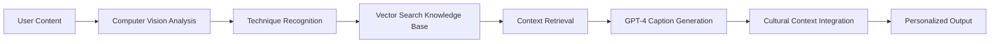

# SnapCraft 🔨
*RAG-Enhanced Social Platform for Craftsmen & Artisans*

[](https://reactnative.dev/)
[](https://expo.dev/)
[](https://firebase.google.com/)
[](https://openai.com/)
[](https://pinecone.io/)

> **Share Craft Wisdom. Build Community. Preserve Traditions.**

SnapCraft revolutionizes how craftsmen share knowledge by combining ephemeral social features with RAG-powered AI that understands traditional techniques, materials, and the cultural context of craft traditions. Unlike generic social platforms, SnapCraft treats craft content with the depth and respect it deserves.

🎉 **Latest Breakthrough**: Native camera video recording now fully functional with real video file storage (June 27, 2025)

---

## 🎯 **The Vision: Social Media That Builds Rather Than Destroys**

### **The Problem with Current Platforms**
- **Surface-Level Understanding**: Platforms treat craft content as generic media, missing technical depth
- **Tool Frustration**: Users see projects requiring equipment they don't own, leading to abandonment  
- **Knowledge Fragmentation**: Traditional craft knowledge scattered without contextual connections
- **Attention Destruction**: Quick dopamine hits prevent deep skill development
- **Monetization Barriers**: Skilled craftsmen struggle to build sustainable businesses

### **The SnapCraft Solution**
**SpikeyPOV**: SnapCraft pushes back against the consensus that Artisans and Craftsmen are obsolete in the age of mass production, by providing a platform for Artisans and Craftsmen to not only showcase, advertise, and sell their custom, made-to-order specialty pieces of craftsmanship, but also allows them to supplement their income through social media views.

SnapCraft leverages **Retrieval-Augmented Generation (RAG)** to create the first social platform that:
- ✨ **Understands Craft Context**: AI that recognizes techniques, materials, and cultural significance
- 🔧 **Matches Tools & Skills**: Personalized content based on your equipment and skill level  
- 🌍 **Connects Traditions**: Links techniques across different craft cultures and time periods
- 📚 **Builds Attention Spans**: Process-focused content that rewards patience and deep learning
- 💰 **Enables Creator Economy**: Direct monetization for traditional craftsmen and artisans

---

## 🤖 **RAG-Powered Intelligence Features**

### **1. Intelligent Process Documentation** ✨ *Core Infrastructure Complete*
```
🎥 Record your craft process → 🧠 AI analyzes techniques → 📝 Generates expert captions
```
- **✅ Video Recording**: Native camera integration with real video file storage (June 27, 2025)
- **Technique Recognition**: Computer vision identifies traditional building methods, joinery, metalwork
- **Cultural Context**: RAG provides historical background and regional variations
- **Material Insights**: AI explains wood species, stone types, clay composition, fiber characteristics
- **Expert Knowledge**: Captions written in the style of master craftsmen like Roy Underhill, John Plant

### **2. Skill-Progressive Content Discovery**
```
📊 Skill Assessment → 🔧 Tool Inventory → 🎯 Personalized Recommendations
```
- **Tool Matching**: See only projects you can actually build with your current equipment
- **Skill Progression**: Content suggestions that build naturally on your current abilities
- **Learning Pathways**: Structured progression from novice to master craftsman
- **Equipment Guidance**: Smart suggestions for next tool purchases based on your interests

### **3. Cross-Technique Knowledge Bridging**
```
🏗️ Timber Framing ↔️ 🏺 Pottery ↔️ ⚒️ Blacksmithing
```
- **Universal Principles**: AI identifies shared concepts across different craft traditions
- **Cultural Exchange**: Learn how different cultures solved similar problems
- **Skill Transfer**: Apply woodworking joints to metalwork, pottery techniques to stone carving
- **Innovation Inspiration**: Combine traditional techniques in novel ways

### **4. Material Identification & Regional Sourcing**
```
📍 Your Location + 🌿 Local Materials = 🗺️ Sourcing Guidance
```
- **Visual Recognition**: Point your camera at materials for instant identification
- **Seasonal Timing**: Know when to harvest bark, cut timber, collect clay
- **Sustainable Practices**: Traditional ecological knowledge for responsible sourcing
- **Local Alternatives**: Find regional substitutes for traditional materials

### **5. Creator Economy Intelligence**
```
📈 Performance Analytics + 🎯 Audience Insights = 💰 Monetization Strategy
```
- **Authentic Content Optimization**: Improve engagement while preserving craft integrity
- **Audience Building**: Connect with serious craft enthusiasts, not casual browsers
- **Revenue Opportunities**: Custom commissions, workshops, tool sales, pattern licensing
- **Brand Development**: Build reputation as a master craftsman in your specialty

---

## 📱 **Core Features**

### **Ephemeral Craft Stories**
- 24-hour disappearing stories optimized for process documentation
- Native camera integration via ImagePicker for reliable video recording
- Multi-segment stories for complex builds
- Real video file storage and Firebase upload

### **Knowledge-Enhanced Messaging**
- Direct messaging with AI-powered craft advice
- Group conversations for craft communities and apprentice circles
- Shared project collaboration with progress tracking
- Expert mentorship connections

### **Traditional Craft Feed**
- Algorithm prioritizes process over product
- Content filtered by your skill level and available tools
- Featured masters and traditional techniques
- Seasonal craft calendars and material availability

### **Skill & Tool Management**
- Personal tool inventory with upgrade recommendations
- Skill progression tracking across multiple craft disciplines
- Achievement system based on traditional apprenticeship milestones
- Safety certifications and best practices integration

---

## 🏗️ **Technical Architecture**

### **Frontend Stack**
```typescript
React Native + Expo SDK 53
├── 🎨 UI: Native iOS Components + Custom Craft Theme
├── 📱 Navigation: Expo Router (File-based routing)
├── 🗄️ State: Zustand for Global State Management
├── 📸 Media: Expo ImagePicker + Video for Native Camera Integration
├── 🔥 Backend: Firebase SDK for Real-time Features
└── 🤖 AI: OpenAI SDK for RAG Integration
```

### **Backend Infrastructure**
```yaml
Firebase Ecosystem:
  Auth: Firebase Auth with Custom Claims
  Database: Firestore with Craft-Optimized Schema
  Storage: Firebase Storage for Media Files
  Functions: Cloud Functions for RAG Processing

RAG Infrastructure:
  Vector DB: Pinecone for Semantic Search
  LLM: OpenAI GPT-4 for Content Generation
  Knowledge Base: Expert Craft Content in Vector Format
  Processing: Cloud Functions Orchestrating RAG Workflow
```

### **RAG Processing Pipeline**


---

## 🚀 **Getting Started**

### **Prerequisites**
- Node.js 18+ and npm/yarn
- Expo CLI (`npm install -g @expo/cli`)
- iOS Simulator (Xcode) or physical iOS device
- Firebase account with project setup
- OpenAI API key for RAG features (optional for basic testing)
- Pinecone account for vector database (optional for basic testing)

### **Installation**
```bash
# Clone the repository
git clone https://github.com/trevoralpert/snapcraft.git
cd snapcraft

# Install dependencies
npm install

# Set up environment variables
cp env.example .env
# Edit .env with your Firebase credentials

# Start the development server
npx expo start
```

### **Environment Configuration**
See `env.example` for the complete list of required environment variables. Key variables include:
- Firebase configuration (API key, project ID, etc.)
- OpenAI API key (optional for basic testing)
- Pinecone configuration (optional for basic testing)

### **Firebase Setup**
1. Create a new Firebase project
2. Enable Authentication (Email/Password)
3. Set up Firestore database
4. Configure Firebase Storage
5. Deploy security rules from `firestore.rules` and `storage.rules`

---

## 📊 **Project Status**

### **✅ Completed Features**
- [x] **Core Social Platform**: Authentication, profiles, posts, stories
- [x] **Camera Integration**: Native video recording via ImagePicker with real file storage
- [x] **Firebase Backend**: Real-time database, storage, security rules
- [x] **Story System**: 24-hour ephemeral content with craft-optimized UI
- [x] **Video Recording**: ✨ **BREAKTHROUGH** - Native camera integration with real video files
- [x] **User Management**: Profiles with craft specializations and skill levels
- [x] **Content Feed**: Craft-themed social feed with engagement features
- [x] **Production Ready**: Comprehensive Firebase security rules and deployment infrastructure

### **🚧 In Development**
- [ ] **RAG Caption Generation**: AI-powered technique recognition and explanations
- [ ] **Tool Inventory System**: Personal equipment tracking and recommendations
- [ ] **Skill Assessment**: Progressive learning pathways and milestone tracking
- [ ] **Material Recognition**: Computer vision for identifying craft materials
- [ ] **Cross-Technique Bridging**: Connecting related skills across craft domains

### **📋 Planned Features**
- [ ] **Expert Knowledge Base**: Vectorized content from master craftsmen
- [ ] **Regional Sourcing**: Location-based material availability
- [ ] **Creator Monetization**: Revenue tools for traditional craftsmen
- [ ] **Safety Integration**: Proactive safety suggestions and best practices
- [ ] **Cultural Context**: Historical and anthropological craft knowledge

---

## 🔧 **Key Dependencies**

### **Core Framework**
- **React Native 0.79.4** - Mobile app framework
- **Expo SDK 53** - Development platform and tools
- **TypeScript 5.8.3** - Type safety and development experience

### **Navigation & UI**
- **Expo Router 5.1** - File-based navigation system
- **React Native Reanimated 3.17** - Smooth animations and gestures
- **React Native Safe Area Context 5.4** - Safe area management

### **State Management & Data**
- **Zustand 5.0.5** - Lightweight state management
- **React Query 5.81** - Server state management and caching
- **Zod 3.25** - Runtime validation and type safety

### **Firebase Integration**
- **Firebase 11.9.1** - Backend services (Auth, Firestore, Storage)
- **React Native Async Storage 2.1** - Local data persistence

### **Media & Camera**
- **Expo Image Picker 16.1** - Native camera and gallery access
- **Expo Video 2.2** - Video playback and processing
- **Expo Image 2.3** - Optimized image handling

### **AI & RAG**
- **OpenAI 5.7.0** - GPT-4 integration for intelligent content generation
- **Crypto-js 4.2.0** - Secure data handling for API communications

### **Development Tools**
- **Expo Dev Client 5.2** - Custom development builds
- **Firebase Tools 14.9** - Firebase CLI and deployment
- **Jest 29.2** - Testing framework
- **Prettier 3.6** - Code formatting

---

## 🤝 **Contributing**

We welcome contributions from both developers and craft experts! Please check our GitHub Issues for current opportunities to contribute.

### **For Developers**
- Report bugs and suggest features via GitHub Issues
- Submit pull requests for code improvements
- Help improve RAG accuracy and performance
- Contribute to documentation and guides

### **For Craft Experts**
- Share traditional knowledge for the AI knowledge base
- Provide feedback on technique recognition accuracy
- Suggest safety guidelines and best practices
- Help with cultural context and historical accuracy

---

## 📄 **License**

This project is licensed under the MIT License - see the [LICENSE](LICENSE) file for details.

---

## 🙏 **Acknowledgments**

### **Craft Experts & Inspiration**
- **Dick Proenneke** - Wilderness cabin building and tool making
- **John Plant** - Primitive Technology YouTube channel
- **Roy Underhill** - The Woodwright's Shop and traditional techniques
- **Peter Follansbee** - 17th Century Woodworking expertise
- **Foresty Forest** - Modern primitive building content

### **Technical Foundation**
- **OpenAI** - GPT-4 for intelligent content generation
- **Pinecone** - Vector database for semantic search
- **Firebase** - Backend infrastructure and real-time features
- **Expo** - React Native development platform

---

## 📞 **Contact**

- **Project Repository**: [github.com/trevoralpert/snapcraft](https://github.com/trevoralpert/snapcraft)
- **Issues & Support**: [GitHub Issues](https://github.com/trevoralpert/snapcraft/issues)

---

*Built with ❤️ for the global community of craftsmen, artisans, and traditional knowledge keepers.* 