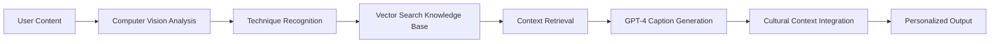

# SnapCraft 🔨
*RAG-Enhanced Social Platform for Craftsmen & Artisans*

[](https://reactnative.dev/)
[](https://expo.dev/)
[](https://firebase.google.com/)
[](https://openai.com/)
[](https://pinecone.io/)

> **Share Craft Wisdom. Build Community. Preserve Traditions.**

SnapCraft revolutionizes how craftsmen share knowledge by combining ephemeral social features with RAG-powered AI that understands traditional techniques, materials, and the cultural context of craft traditions. Unlike generic social platforms, SnapCraft treats craft content with the depth and respect it deserves.

🎉 **Latest Update**: Complete platform overhaul with AI scoring, onboarding system, achievements, and enhanced Profile experience (June 29, 2025)

---

## 🎯 **The Vision: Social Media That Builds Rather Than Destroys**

### **The Problem with Current Platforms**
- **Surface-Level Understanding**: Platforms treat craft content as generic media, missing technical depth
- **Tool Frustration**: Users see projects requiring equipment they don't own, leading to abandonment  
- **Knowledge Fragmentation**: Traditional craft knowledge scattered without contextual connections
- **Attention Destruction**: Quick dopamine hits prevent deep skill development
- **Monetization Barriers**: Skilled craftsmen struggle to build sustainable businesses

### **The SnapCraft Solution**
**SpikeyPOV**: SnapCraft pushes back against the consensus that Artisans and Craftsmen are obsolete in the age of mass production, by providing a platform for Artisans and Craftsmen to not only showcase, advertise, and sell their custom, made-to-order specialty pieces of craftsmanship, but also allows them to supplement their income through social media views.

SnapCraft leverages **Retrieval-Augmented Generation (RAG)** to create the first social platform that:
- ✨ **Understands Craft Context**: AI that recognizes techniques, materials, and cultural significance
- 🔧 **Matches Tools & Skills**: Personalized content based on your equipment and skill level  
- 🌍 **Connects Traditions**: Links techniques across different craft cultures and time periods
- 📚 **Builds Attention Spans**: Process-focused content that rewards patience and deep learning
- 💰 **Enables Creator Economy**: Direct monetization for traditional craftsmen and artisans

---

## 🤖 **RAG-Powered Intelligence Features**

### **1. AI-Powered Project Scoring** ✨ *FULLY IMPLEMENTED*
```
📸 Upload project photos → 🧠 GPT-4 Vision analysis → 📊 Detailed scoring & feedback
```
- **✅ Computer Vision Analysis**: GPT-4 Vision evaluates craft quality, technique execution, and material usage
- **✅ Skill Level Assessment**: Dynamic skill progression from Novice → Apprentice → Journeyman → Craftsman → Master
- **✅ Detailed Feedback**: AI provides specific improvement suggestions and technique recommendations
- **✅ Progress Tracking**: Historical scoring data tracks skill development over time
- **✅ Craft-Specific Scoring**: Specialized evaluation criteria for woodworking, metalworking, leathercraft, and more

### **2. Intelligent Process Documentation** ✨ *Core Infrastructure Complete*
```
🎥 Record your craft process → 🧠 AI analyzes techniques → 📝 Generates expert captions
```
- **✅ Video Recording**: Native camera integration with real video file storage
- **Technique Recognition**: Computer vision identifies traditional building methods, joinery, metalwork
- **Cultural Context**: RAG provides historical background and regional variations
- **Material Insights**: AI explains wood species, stone types, clay composition, fiber characteristics
- **Expert Knowledge**: Captions written in the style of master craftsmen like Roy Underhill, John Plant

### **3. Skill-Progressive Content Discovery** ✨ *FULLY IMPLEMENTED*
```
📊 Skill Assessment → 🔧 Tool Inventory → 🎯 Personalized Recommendations
```
- **✅ Tool Matching**: Smart tool inventory system with AI-powered identification
- **✅ Skill Progression**: Content suggestions that build naturally on your current abilities
- **✅ Learning Pathways**: Structured progression with achievement milestones
- **✅ Equipment Guidance**: Smart suggestions for next tool purchases based on your interests

### **4. Interactive Learning System** ✨ *FULLY IMPLEMENTED*
```
🎓 Guided Tutorials → 🔨 First Project Templates → 📈 Progress Analytics
```
- **✅ Interactive Tutorials**: 3 comprehensive tutorials (Camera Basics, Tool Identification, Project Documentation)
- **✅ First Project Guidance**: 3 beginner-friendly project templates with step-by-step instructions
- **✅ Achievement System**: 20+ achievements tracking onboarding, learning, and skill milestones
- **✅ Analytics Dashboard**: Comprehensive progress tracking with insights and recommendations

### **5. Community & Social Features** ✨ *FULLY IMPLEMENTED*
```
❤️ Likes & Comments → 📤 Sharing → 📖 Stories → 👥 Community Building
```
- **✅ Social Interactions**: Like, comment, and share craft projects with the community
- **✅ Ephemeral Stories**: 24-hour disappearing stories optimized for process documentation
- **✅ Story Analytics**: View counts, viewer tracking, and engagement metrics
- **✅ Community Feed**: Craft-focused social feed with authentic maker content

---

## 📱 **Core Features**

### **Complete Onboarding Experience** ✨ *NEW*
- **5-Step Welcome Flow**: Craft specialization, camera permissions, tool introduction, first project
- **Interactive Tutorials**: Hands-on learning for camera features, tool identification, and documentation
- **Guided First Project**: Choose from 3 beginner templates with step-by-step assistance
- **Progress Tracking**: Firebase-integrated onboarding analytics with completion milestones

### **AI-Powered Scoring System** ✨ *NEW*
- **GPT-4 Vision Integration**: Advanced computer vision analysis of craft projects
- **Skill Level Calculation**: Dynamic progression system based on project quality and consistency
- **Detailed Feedback**: Specific improvement suggestions and technique recommendations
- **Historical Progress**: Track skill development over time with scoring analytics

### **Enhanced Profile Experience** ✨ *NEW*
- **Projects Showcase**: Display your craft work with statistics and progress tracking
- **Achievement Gallery**: Real-time achievement system with 20+ milestones and progress bars
- **Project Creation Walkthrough**: Integrated guidance system for documenting new projects
- **Analytics Dashboard**: Personal analytics with onboarding progress, tutorial completion, and insights

### **Smart Tool Management** ✨ *ENHANCED*
- **AI Tool Identification**: Computer vision-powered tool recognition and inventory management
- **Tool-Based Recommendations**: Content filtered by your available equipment
- **Inventory Tracking**: Personal tool collection with upgrade suggestions
- **Project Compatibility**: See only projects you can actually build with your tools

### **Ephemeral Craft Stories**
- **24-hour disappearing stories** optimized for process documentation
- **Native camera integration** via ImagePicker for reliable video recording
- **Multi-segment stories** for complex builds
- **Real video file storage** and Firebase upload
- **Story analytics** with view counts and viewer tracking

### **Knowledge-Enhanced Social Feed**
- **Craft-focused content** with authentic maker community
- **Like and comment system** with real-time engagement
- **Native sharing** functionality for cross-platform distribution
- **Algorithm prioritizes** process over product
- **Content filtered** by your skill level and available tools

### **Comprehensive Analytics** ✨ *NEW*
- **4-Tab Analytics Dashboard**: Overview, Funnel Analysis, Cohort Tracking, Automated Insights
- **Onboarding Analytics**: Step completion rates, drop-off analysis, and optimization recommendations
- **Tutorial Progress**: Completion tracking across all interactive learning modules
- **User Journey Insights**: Behavioral analytics and engagement patterns

---

## 🏗️ **Technical Architecture**

### **Frontend Stack**
```typescript
React Native + Expo SDK 53
├── 🎨 UI: Native iOS Components + Custom Craft Theme
├── 📱 Navigation: Expo Router (File-based routing)
├── 🗄️ State: Zustand for Global State Management
├── 📸 Media: Expo ImagePicker + Video for Native Camera Integration
├── 🔥 Backend: Firebase SDK for Real-time Features
├── 🤖 AI: OpenAI SDK for RAG Integration + GPT-4 Vision
└── 📊 Analytics: Custom analytics service with Firebase integration
```

### **Backend Infrastructure**
```yaml
Firebase Ecosystem:
  Auth: Firebase Auth with Custom Claims
  Database: Firestore with Craft-Optimized Schema
  Storage: Firebase Storage for Media Files
  Functions: Cloud Functions for RAG Processing

RAG Infrastructure:
  Vector DB: Pinecone for Semantic Search
  LLM: OpenAI GPT-4 for Content Generation + Vision Analysis
  Knowledge Base: Expert Craft Content in Vector Format
  Processing: Cloud Functions Orchestrating RAG Workflow

AI Scoring Pipeline:
  Vision Analysis: GPT-4 Vision for project evaluation
  Skill Assessment: Dynamic progression calculation
  Feedback Generation: Contextual improvement suggestions
  Progress Tracking: Historical skill development analytics
```

### **RAG Processing Pipeline**


---

## 🚀 **Getting Started**

### **Prerequisites**
- Node.js 18+ and npm/yarn
- Expo CLI (`npm install -g @expo/cli`)
- iOS Simulator (Xcode) or physical iOS device
- Firebase account with project setup
- OpenAI API key for RAG features (optional for basic testing)
- Pinecone account for vector database (optional for basic testing)

### **Installation**
```bash
# Clone the repository
git clone https://github.com/trevoralpert/snapcraft.git
cd snapcraft

# Install dependencies
npm install

# Set up environment variables
cp env.example .env
# Edit .env with your Firebase credentials

# Start the development server
npx expo start
```

### **Environment Configuration**
See `env.example` for the complete list of required environment variables. Key variables include:
- Firebase configuration (API key, project ID, etc.)
- OpenAI API key (optional for basic testing)
- Pinecone configuration (optional for basic testing)

### **Firebase Setup**
1. Create a new Firebase project
2. Enable Authentication (Email/Password)
3. Set up Firestore database
4. Configure Firebase Storage
5. Deploy security rules from `firestore.rules` and `storage.rules`

---

## 📊 **Project Status**

### **✅ Completed Features (Production Ready)**
- [x] **🎓 Complete Onboarding System**: 5-step welcome flow with craft specialization selection
- [x] **📚 Interactive Tutorials**: 3 comprehensive tutorials with progress tracking
- [x] **🔨 First Project Guidance**: 3 beginner templates with step-by-step instructions
- [x] **🤖 AI Scoring System**: GPT-4 Vision-powered project evaluation and skill assessment
- [x] **🏆 Achievement System**: 20+ real achievements with progress tracking and points
- [x] **📊 Analytics Dashboard**: 4-tab comprehensive analytics with insights and recommendations
- [x] **👤 Enhanced Profile**: Projects showcase, achievements gallery, and integrated guidance
- [x] **📱 Core Social Platform**: Authentication, profiles, posts, stories with full engagement
- [x] **📸 Camera Integration**: Native video recording via ImagePicker with real file storage
- [x] **🔥 Firebase Backend**: Real-time database, storage, comprehensive security rules
- [x] **📖 Story System**: 24-hour ephemeral content with craft-optimized UI and analytics
- [x] **❤️ Social Features**: Likes, comments, sharing with real-time updates
- [x] **🔧 Tool Management**: AI-powered tool identification and inventory system
- [x] **📈 Skill Progression**: Dynamic skill level calculation with historical tracking

### **🚧 In Development**
- [ ] **RAG Caption Generation**: AI-powered technique recognition and explanations
- [ ] **Material Recognition**: Computer vision for identifying craft materials
- [ ] **Cross-Technique Bridging**: Connecting related skills across craft domains
- [ ] **Advanced Analytics**: Predictive insights and personalized recommendations

### **📋 Planned Features**
- [ ] **Expert Knowledge Base**: Vectorized content from master craftsmen
- [ ] **Regional Sourcing**: Location-based material availability
- [ ] **Creator Monetization**: Revenue tools for traditional craftsmen
- [ ] **Safety Integration**: Proactive safety suggestions and best practices
- [ ] **Cultural Context**: Historical and anthropological craft knowledge

---

## 🔧 **Key Dependencies**

### **Core Framework**
- **React Native 0.79.4** - Mobile app framework
- **Expo SDK 53** - Development platform and tools
- **TypeScript 5.8.3** - Type safety and development experience

### **Navigation & UI**
- **Expo Router 5.1** - File-based navigation system
- **React Native Reanimated 3.17** - Smooth animations and gestures
- **React Native Safe Area Context 5.4** - Safe area management

### **State Management & Data**
- **Zustand 5.0.5** - Lightweight state management
- **React Query 5.81** - Server state management and caching
- **Zod 3.25** - Runtime validation and type safety

### **Firebase Integration**
- **Firebase 11.9.1** - Backend services (Auth, Firestore, Storage)
- **React Native Async Storage 2.1** - Local data persistence

### **Media & Camera**
- **Expo Image Picker 16.1** - Native camera and gallery access
- **Expo Video 2.2** - Video playback and processing
- **Expo Image 2.3** - Optimized image handling

### **AI & RAG**
- **OpenAI 5.7.0** - GPT-4 integration for intelligent content generation and vision analysis
- **Crypto-js 4.2.0** - Secure data handling for API communications

### **Development Tools**
- **Expo Dev Client 5.2** - Custom development builds
- **Firebase Tools 14.9** - Firebase CLI and deployment
- **Jest 29.2** - Testing framework
- **Prettier 3.6** - Code formatting

---

## 🤝 **Contributing**

We welcome contributions from both developers and craft experts! Please check our GitHub Issues for current opportunities to contribute.

### **For Developers**
- Report bugs and suggest features via GitHub Issues
- Submit pull requests for code improvements
- Help improve RAG accuracy and performance
- Contribute to documentation and guides

### **For Craft Experts**
- Share traditional knowledge for the AI knowledge base
- Provide feedback on technique recognition accuracy
- Suggest safety guidelines and best practices
- Help with cultural context and historical accuracy

---

## 📄 **License**

This project is licensed under the MIT License - see the [LICENSE](LICENSE) file for details.

---

## 🙏 **Acknowledgments**

### **Craft Experts & Inspiration**
- **Dick Proenneke** - Wilderness cabin building and tool making
- **John Plant** - Primitive Technology YouTube channel
- **Roy Underhill** - The Woodwright's Shop and traditional techniques
- **Peter Follansbee** - 17th Century Woodworking expertise
- **Foresty Forest** - Modern primitive building content

### **Technical Foundation**
- **OpenAI** - GPT-4 for intelligent content generation and vision analysis
- **Pinecone** - Vector database for semantic search
- **Firebase** - Backend infrastructure and real-time features
- **Expo** - React Native development platform

---

## 📞 **Contact**

- **Project Repository**: [github.com/trevoralpert/snapcraft](https://github.com/trevoralpert/snapcraft)
- **Issues & Support**: [GitHub Issues](https://github.com/trevoralpert/snapcraft/issues)

---

*Built with ❤️ for the global community of craftsmen, artisans, and traditional knowledge keepers.* 